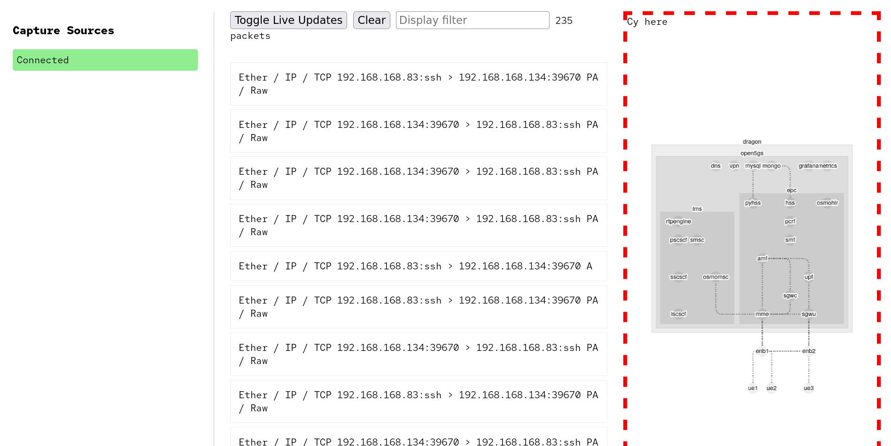

# CoreDump

Network visualization tool originally focused on LTE network troubleshooting.

Captures and visualizes packet flows across complex service meshes, helping you
understand what's actually happening versus what should be happening.

Originally made (with a fair bit of AI at the time) to troubleshoot a specific Baicells eNB bug with GTP.

Later was just kinda neat. Lots of room to improve.

License: AGPLv3 (at least as far as my actual contributions).

## Features
- Packet capture from multiple hosts, including all interfaces and all interfaces in all containers.

## FutureFeatures
- Protocol-aware packet analysis (GTP, S1AP, Diameter)
- Interactive graph visualization of service relationships
- Compare actual vs expected packet flows
- Stream captures in real-time or analyze stored captures

## Use Cases
- Debug LTE core network services
- Visualize GTP tunnel flows
- Track session establishment
- Identify protocol mismatches
- Analyze handover issues
- Map service dependencies
- Why the fuck is my Baicells eNB doing X


## How to use

This has a web server with websocket support, through which it ingests
packets from either the python agent or tcpdump piped into curl - more
on that in `ingestion` section - and then pipes those packets into the
frontend, parsed a bit. The backend/frontend match packets to a pre-made
list of hosts arranged in a hierarchy that represent your visualized
network. 

So you'll need something like the typical python setup:
```
python -m venv env
source env/bin/activate
pip install -r requirements.txt
python main.py #starts a server

#then, in another terminal, having modified test.sh to fit your system:
bash test.sh
```

You may also be interested in 
- `capture.py`, a python equivalent capture
client very similar to the test.sh using scapy (which could be easily
extended to do dynamic client-side filtering, or submit via mqtt/mqtt over
websockets or the like), and 
- `dc_capture.py` which automatically instruments
all the containers in a docker compose stack (such as open5gs).


<!--I am done with tabbing through five workspaces and a billion
terminals (or worse one or more screen sessions), only to have to
tcpdump -w, scp it back home, open that in wireshark, and repeat over and
over. So. OpenObserve and packet captures in one place will be good.I
am done with tabbing through five workspaces and a billion terminals
(or worse one or more screen sessions), only to have to tcpdump
-w, scp it back home, open that in wireshark, and repeat over and
over. So. OpenObserve and packet captures in one place will be good.-->

## What it looks like


or see the video:

<video src="./docs/2025-04-11_04-42-37.mp4" controls width="600"></video>


## Suggested improvements
- View packets on a timeline, and scroll through them or play forward/back
at different speeds. Useful for seeing which packets came first, and would
allow for accurate visualization of packet times (right now tx/rx appear
nearly instantaneously since it's seen at real time, and the first packet
and reply packet of a stream appear to cross each other, which is not the
best visualization). Recommend Clickhouse for storage/replay in this case.

- Dynamic filtering of packets to zero in on salient packets.

This could easily be a fantastic troubleshooting tool. With very minor
tweaks, it could also feed an SVG digital twin in something like grafana.

It's trivial to do any network, what you see at time of writing
is an open5gs docker deployment.

It's also trivial to make it be fully dynamic and just show hosts
automatically and arrange them automatically.

I did not like the results when I did that as much as I liked a hardcoded
map, but your mileage may vary.
